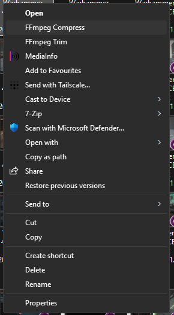

# Windows Context Menu Tools

A small collection of registry tweaks and FFmpeg-based Windows Explorer context menu tools.

Features:
- Remove "Ask Copilot"
- Remove "Edit with Clipchamp"
- FFmpeg Trim
- FFmpeg Compress (HEVC / AV1)

Requires:
- FFmpeg installed
- FFmpeg added to PATH
- NVIDIA GPU is required for compression. Not required for trim.

See `_README.txt` for full installation instructions including FFmpeg PATH configuration.

